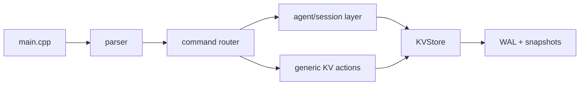

# AgentKV

AgentKV is a from-scratch C++17 key-value store built to explore the systems
problems behind durability, recovery, and stateful agent memory.

Today, the project includes:
- An in-memory storage engine backed by `std::unordered_map`
- A durable write path with an append-only write-ahead log
- Snapshotting plus crash recovery via snapshot load and WAL tail replay
- A lightweight Phase 2.5 agent session layer stored on top of the generic KV
  engine
- Unit, integration, stress, and recovery tests with GoogleTest

## Why This Project Is Interesting

This is not a wrapper around an existing database. The goal is to build the
core layers manually and make the tradeoffs visible:

- How do you make writes durable without turning the codebase into a full
  storage engine too early?
- How do you recover cleanly after a crash?
- How do you layer agent-specific state on top of a generic KV store without
  polluting the storage engine?
- How do you keep the design simple enough to explain in an interview, while
  still making it technically real?

That balance is the point of AgentKV: small enough to understand end-to-end,
serious enough to demonstrate systems thinking.

## Recruiting Snapshot

AgentKV demonstrates:
- C++17 systems programming with careful ownership and clear interfaces
- Durable storage design using WAL + snapshots
- Crash recovery and replay logic
- API layering and separation of concerns
- Test-driven development across unit, integration, and persistence scenarios
- Incremental architecture work toward agent-oriented infrastructure

## Current Scope

The current architecture is intentionally simple:



Design intent:
- `main.cpp` bootstraps persistence and handles stdin/stdout
- `parser` only validates request shape
- `command` routes actions
- `agent/session` owns Phase 2.5 semantics
- `KVStore` stays generic and treats keys as opaque strings

## What AgentKV Does Today

### Core KV Engine

- `put`, `get`, and `delete`
- In-memory reads and writes for the active working set
- Generic string-key / string-value storage

### Durability

- Append-only binary write-ahead log
- `SET` is flushed to WAL before memory mutation
- `DELETE` operations are also logged for replay consistency
- Periodic and manual snapshots
- Recovery by loading the latest snapshot, then replaying the WAL tail

### Phase 2.5 Agent Session Layer

The session layer is designed to keep correctness simple: one session is stored
as one JSON document under one KV key:

- Key: `sessions/<session_id>`
- Value: full session document including metadata, state, and event history

That means one logical session mutation maps to one `KVStore::Set()` call and
one WAL record. This avoids partial session updates without introducing
transactions into the storage engine.

Example shape:

```json
{
  "metadata": {
    "session_id": "session_123",
    "status": "active",
    "created_at": "2026-04-26T12:00:00Z",
    "updated_at": "2026-04-26T12:05:00Z",
    "last_seq": 3
  },
  "state": {
    "goal": "write tests",
    "status": "testing"
  },
  "events": [
    {
      "seq": 1,
      "timestamp": "2026-04-26T12:01:00Z",
      "action": "write_file",
      "input": {
        "path": "tests/session_test.cpp"
      },
      "output": {
        "result": "created test file"
      },
      "state_diff": {
        "status": "testing"
      }
    }
  ]
}
```

Supported session actions:
- `begin_session`
- `get_state`
- `update_state`
- `log_step`
- `get_recent_steps`
- `get_context`
- `replay`

## Example API

Create a session:

```json
{
  "action": "begin_session",
  "params": {
    "initial_state": {
      "goal": "write tests",
      "status": "started"
    }
  }
}
```

Append a step:

```json
{
  "action": "log_step",
  "params": {
    "session_id": "abc123",
    "action": "write_file",
    "input": {
      "path": "tests/session_test.cpp"
    },
    "output": {
      "result": "created test file"
    },
    "state_diff": {
      "status": "testing",
      "last_file": "tests/session_test.cpp"
    }
  }
}
```

Fetch agent-facing context:

```json
{
  "action": "get_context",
  "params": {
    "session_id": "abc123",
    "limit": 5
  }
}
```

Replay state from the event log:

```json
{
  "action": "replay",
  "params": {
    "session_id": "abc123"
  }
}
```

## Durability Model

The persistence model is deliberately straightforward:

1. Mutations append to the WAL and flush before in-memory mutation.
2. Snapshots checkpoint the in-memory map and record the WAL byte offset they
   cover.
3. On startup, the store loads the snapshot first.
4. It then replays only the WAL tail after the recorded offset.

This gives the project a clean, explainable recovery story without needing a
full LSM tree yet.

Additional safety details:
- Replay stops safely at incomplete trailing records
- Corrupted lengths are bounded to avoid unbounded allocations
- Snapshot writes use a temp-file-plus-rename flow

## Performance Snapshot

The repository includes a benchmark executable under `bench/`. The current
checked-in baseline is useful as a local reference point rather than a portable
claim.

| Workload | Operations | Throughput | Notes |
| --- | ---: | ---: | --- |
| Write | 20,000 | 223,395.57 ops/sec | Persisted `SET` path with WAL flushes |
| Read | 20,000 | 4,470,689.38 ops/sec | In-memory successful `GET` after preload |
| Mixed | 20,000 | 902,398.15 ops/sec | Deterministic 70/30 read/write workload |
| Recovery | 20,000 base + 999 tail | 8.38 ms | Snapshot load plus WAL tail replay |
| Snapshot | 20,000 records | 4.21 ms | Explicit full-state snapshot |

See [docs/benchmark.md](docs/benchmark.md) for the full benchmark notes.

## Testing

The test suite covers:
- Core KV correctness
- WAL replay ordering and malformed-record handling
- Snapshot save/load and corruption scenarios
- Recovery behavior across restart cycles
- Session-layer state updates, context retrieval, and replay
- Stress workloads across many keys and larger persisted states

Current verification commands:

```bash
make
make test
make test_stress
```

## Quick Start

Build:

```bash
make
```

Run a generic KV request:

```bash
echo '{"action":"put","params":{"key":"x","value":"y"}}' | ./bin/kv_store
echo '{"action":"get","params":{"key":"x"}}' | ./bin/kv_store
```

Run a session request:

```bash
echo '{"action":"begin_session","params":{"initial_state":{"goal":"write tests"}}}' | ./bin/kv_store
```

The binary stores persistence under `data/` by default:
- `data/kv_store.wal`
- `data/kv_store.snapshot`

To use a different persistence directory:

```bash
echo '{"action":"get","params":{"key":"x"}}' | ./bin/kv_store --db ./my_db
```

## Build Dependencies

AgentKV uses:
- A C++17 compiler
- [`nlohmann/json`](https://github.com/nlohmann/json) single-header library
- GoogleTest for test targets

The Makefile auto-detects common include locations for `nlohmann/json` and
GoogleTest. If they are installed elsewhere, pass include/library paths through
`CPPFLAGS`, `LDFLAGS`, or `GTEST_ROOT`.

Helpful targets:

```bash
./scripts/bootstrap_gtest.sh
make test
make test_verbose
make test_stress
make run_benchmark
make clean
```

## Repository Layout

```text
src/main.cpp         Program entrypoint and persistence bootstrap
src/parser/          JSON request parsing and validation
src/command/         Action routing layer
src/agent/           Phase 2.5 session semantics
src/store/           Generic KV store
src/persistence/     WAL, snapshot, and binary I/O
include/             Public headers
tests/               Unit, integration, recovery, and stress tests
bench/               Benchmark harness and workloads
docs/                Design notes, changelog, devlog, and benchmarks
```

## Notable Design Decisions

- Keep the KV engine generic; do not teach it agent semantics
- Use WAL-before-memory mutation for a clean durability contract
- Store session state as one document per key to keep Phase 2.5 crash behavior
  simple and explainable
- Prefer shallow state merges for now over an overbuilt patch system
- Keep the codebase incremental so each phase has a clear learning goal

## Roadmap

- [x] Phase 1: In-memory single-threaded KV store
- [x] Phase 2: WAL persistence, snapshotting, and crash recovery
- [x] Phase 2.5: Durable agent session layer on top of the generic KV store
- [ ] Phase 3: Storage-engine evolution, compaction, and SSTable work
- [ ] Phase 4: Concurrency
- [ ] Phase 5: Networking and client/server access
- [ ] Phase 6: Replication and fault tolerance

## Demo


